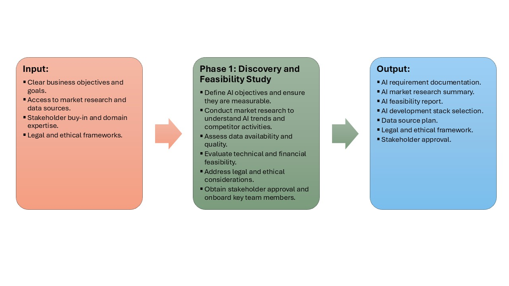

## 📍 Phase 1: Discovery and Feasibility Study

This initial phase is crucial for setting the strategic direction of your AI project. The main goal is to deeply understand the business context, clarify how AI can create value, and determine if the proposed AI solution is viable—technically, legally, financially, and ethically. A successful Phase 1 lays the groundwork for a focused, feasible, and stakeholder-aligned AI initiative.

During this phase, teams engage with business leaders, domain experts, and stakeholders to articulate the problem, define success metrics, explore relevant data assets, and assess the current state of the market and competition. Special attention is given to compliance, bias, and ethical AI practices.

### Inputs

- **Clear business objectives and goals:** Understand the organizational strategy and the specific problems that AI is expected to solve.
- **Market research and data sources:** Insight into industry trends, competitor activity, and the availability of internal or external datasets.
- **Stakeholder buy-in and domain expertise:** Collaboration with business units, SMEs, and technical leaders who can guide scoping and validate ideas.
- **Legal and ethical frameworks:** Policies, regulations, and governance standards that the AI solution must adhere to (e.g., GDPR, HIPAA, fairness, transparency).

### Process

- **Define measurable AI objectives:** Translate broad business goals into specific, measurable AI use cases with defined success criteria.
- **Conduct market/competitor analysis:** Evaluate how competitors or industry leaders are leveraging AI to inform opportunity areas and differentiation.
- **Assess data availability and quality:** Inventory relevant data, assess gaps, and evaluate whether the data is sufficient for training and evaluation.
- **Evaluate technical and financial feasibility:** Determine the readiness of infrastructure, skills, and budget to support development and scaling.
- **Address legal/ethical issues:** Identify compliance risks and develop mitigation strategies to align with responsible AI principles.
- **Gain stakeholder approval and onboard key team members:** Secure executive sponsorship, document support, and recruit the initial project team including product, data, and legal representatives.

### Outputs

- **AI requirement documentation:** A formal write-up outlining the problem statement, business objectives, KPIs, and high-level solution requirements.
- **Market research summary:** A short report capturing insights on AI usage in the domain, competitive intelligence, and relevant trends.
- **Feasibility report:** A comprehensive review covering data readiness, tech stack fit, legal concerns, and go/no-go recommendations.
- **AI development stack selection:** Preliminary decisions about the tooling, frameworks, and platforms to support future phases.
- **Data source plan:** Clear identification of required datasets, ownership, and acquisition strategy.
- **Legal/ethical framework:** A draft or finalized document outlining how the solution will meet compliance and fairness expectations.
- **Stakeholder approval:** Formal sign-off on proceeding to the next phase, with alignment on goals, budget, and responsibilities.

### Before Tasks

- **Identify business drivers and AI use cases:** Align with executive sponsors to discover key business pain points that could benefit from AI.
- **Gather preliminary data and insights:** Pull example datasets, metadata, or dashboards to scope availability and relevance.
- **Draft initial timeline:** Create a rough project schedule including milestones, decision points, and resource planning.

### After Tasks

- **Finalize project scope and objectives:** Lock in what will (and will not) be addressed by the AI engagement.
- **Assemble project team:** Identify the core cross-functional team members required for the next phase—e.g., data engineers, scientists, product owners.
- **Start initial data collection and prep:** Begin acquiring and pre-processing the first batch of data to prepare for Phase 2.
