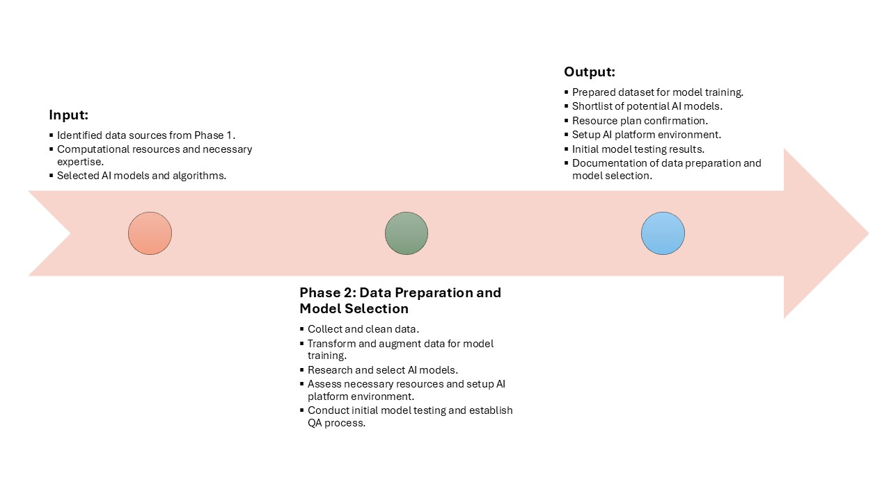

## 📍 Phase 2: Data Preparation and Model Selection

This phase sets the technical foundation for building AI models by focusing on data readiness and model fit. A strong data strategy ensures that the chosen model will perform well and generalize to real-world conditions. Teams also define the tech stack, tooling, and AI frameworks that will be used across the engagement.

### Inputs
- **Validated data sources:** Curated from Phase 1, ensuring compliance, structure, and relevance.
- **Computational resources and domain experts:** Infrastructure (e.g., GPUs, cloud credits) and experienced professionals to guide preprocessing and modeling.
- **AI models and algorithms shortlist:** Initial list of AI models (e.g., transformers, RAG, diffusion models) to evaluate based on use case.

### Process
- **Collect, clean, and transform data:** Apply ETL/ELT processes to prepare training, validation, and test datasets.
- **Augment data for training:** Use techniques like synthetic data generation, oversampling, or noise injection to enhance training.
- **Research and select models:** Conduct literature review and performance comparisons to narrow down best-fit models.
- **Confirm platform/tools and resources:** Finalize cloud tools, model hubs (e.g., Hugging Face), and MLOps pipelines.
- **Initial model testing + QA process setup:** Run baseline model(s), evaluate performance, and set up reproducibility/QA frameworks.

### Outputs
- **Prepared training dataset:** Clean, labeled, and structured data stored in accessible format (e.g., Delta Lake, parquet).
- **Shortlist of AI models:** Annotated list of evaluated models with tradeoffs.
- **Confirmed resource plan:** Documentation of compute, budget, and human resources for modeling and training.
- **AI environment setup:** Configured development environment and CI/CD tools.
- **Initial test results:** Metrics such as accuracy, loss, or F1 score from baseline runs.
- **Documented data/model choices:** Traceable record of why certain data and models were chosen.

### Before Tasks
- **Validate data quality and availability:** Confirm data sufficiency and consistency.
- **Confirm needed resources:** Check availability of GPUs, licenses, and engineers.
- **Identify platforms/tools:** Select libraries, frameworks (e.g., PyTorch, LangChain), and data stores.

### After Tasks
- **Refine model selection:** Shorten the list based on early results.
- **Finalize data steps:** Lock data transformations and freeze datasets.
- **Begin prototype design:** Draft UX, functionality, and integration requirements for the MVP.
