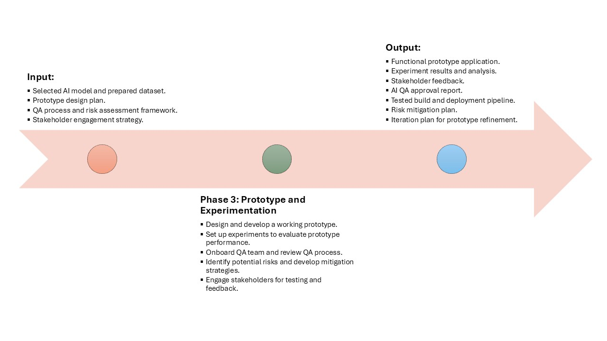

## 📍 Phase 3: Prototype and Experimentation

This phase transforms theory into practice by building a functioning AI prototype. The goal is to validate that the selected model can solve the problem at hand, engage stakeholders, and establish a feedback loop. A mature experimentation process enables iteration and de-risks the transition to production.

### Inputs
- **Prepared data and chosen model:** From Phase 2, ready for rapid prototyping.
- **Prototype design:** Functional and UX requirements that guide what to build and test.
- **QA and risk mitigation plans:** Frameworks for identifying and minimizing failure points.
- **Stakeholder engagement strategy:** Schedule and tools to incorporate business feedback early.

### Process
- **Develop prototype:** Build a lightweight but usable version of the AI application or service.
- **Conduct experiments:** Systematically evaluate performance, usability, and alignment with success metrics.
- **QA team onboarding and process checks:** Train QA teams on tools, metrics, and user flows.
- **Risk analysis and mitigation:** Identify model risks (e.g., hallucination, bias, latency) and mitigation techniques.
- **Engage users/stakeholders for feedback:** Collect qualitative and quantitative insights from test sessions.

### Outputs
- **Functional prototype:** Web app, API, chatbot, etc., depending on the engagement.
- **Test results:** Logs and metrics from A/B testing, simulations, or user trials.
- **Feedback collection:** Surveys, interviews, or feedback board summaries.
- **QA approval:** Sign-off from QA leads ensuring adherence to testing protocols.
- **CI/CD pipeline setup:** Scripted workflows for continuous integration/testing.
- **Risk mitigation plan:** List of known risks and corresponding action items.
- **Prototype refinement roadmap:** Next steps to mature the prototype.

### Before Tasks
- **Lock prototype design:** Freeze requirements for sprint execution.
- **QA checklist validation:** Make sure validation criteria are measurable and complete.
- **Risk identification:** Perform risk storming or threat modeling.

### After Tasks
- **Iterate based on feedback:** Fix bugs, address user feedback.
- **Plan for deployment:** Write release checklist, estimate timelines.
- **Define rollout strategy:** Determine target users, pilots, and KPIs.
