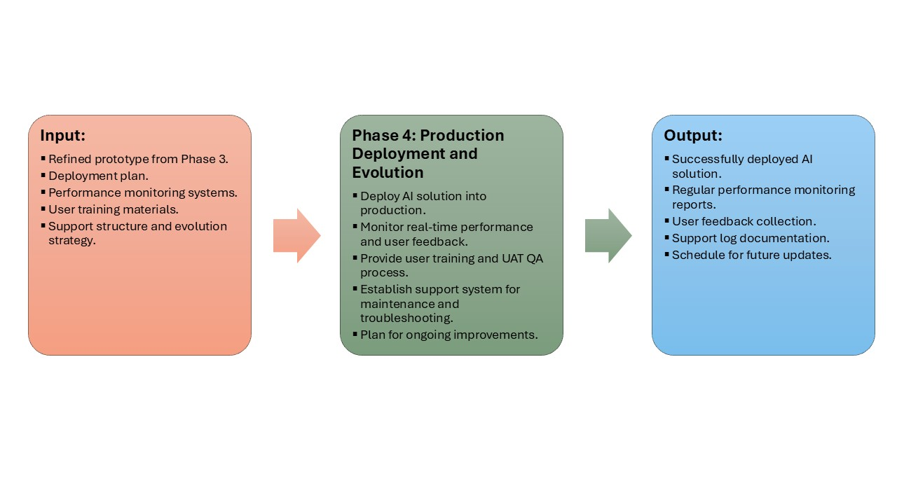

## 📍 Phase 4: Production Deployment and Evolution

The final phase is where the AI solution becomes a production-grade product. It includes launching, monitoring, and supporting the system with a long-term improvement loop. Reliability, governance, and ongoing ROI become priorities.

### Inputs
- **Finalized prototype:** Vetted and refined through stakeholder feedback.
- **Deployment and training plans:** Steps to launch the system and train internal users or customers.
- **Performance monitoring setup:** Dashboards and alerts to track uptime, drift, and success metrics.
- **Support team and strategy:** Resources in place to handle issues and ensure SLA adherence.

### Process
- **Production deployment:** Launch solution in target environment (e.g., cloud, edge, on-prem).
- **Real-time monitoring and feedback loop:** Monitor logs, metrics, and user behavior.
- **User training/UAT QA:** Deliver training sessions, documents, and collect acceptance feedback.
- **Support system rollout:** Create ticketing process, escalation paths, and self-service tools.
- **Plan future improvements:** Prioritize backlog items based on feedback, telemetry, and roadmap.

### Outputs
- **Live AI solution:** Application or API in production.
- **Performance and feedback reports:** Weekly/monthly metrics shared with stakeholders.
- **User training outcomes:** Completion reports and feedback.
- **Support documentation/logs:** Knowledge base articles, incident logs.
- **Evolution roadmap:** Short- and long-term improvements with owners and timelines.

### Before Tasks
- **Finalize deployment checklist:** Review all dependencies and controls.
- **Stand up support structure:** Assign Tier 1/Tier 2 teams and tools.
- **Build training materials:** Create user manuals, walkthrough videos.

### After Tasks
- **Continuous performance tracking:** Use tools like Grafana, MLflow, or Datadog.
- **Ongoing feedback-driven updates:** Refine models or interfaces based on real-world usage.
- **ROI evaluation and reporting:** Report business impact and validate KPIs.
