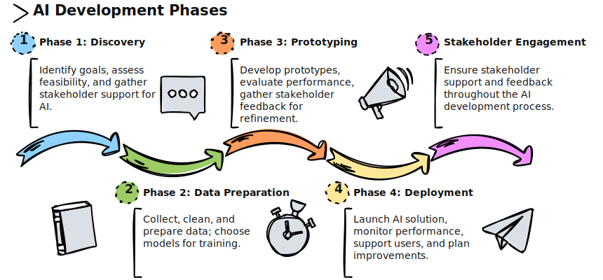

# AI Engagement Accelerator Kit

Welcome to the **AI Engagement Accelerator Kit**. This kit is designed to guide teams through the lifecycle of a Generative AI engagement—from using a *data-driven* approach from initial discovery through production deployment. Each phase includes key inputs, processes, outputs, and tasks to help you stay organized and aligned.

---

## 🧭 Overview of the Phases

.

## This accelerator is broken down into four structured phases:

| **Phases**                                | **Description**                                                                 |
|--------------------------------------------|---------------------------------------------------------------------------------|
| [**1. Discovery and Feasibility Study**](Phase1.md)        | Establish goals, assess feasibility, and align stakeholders.                   |
| [**2. Data Preparation and Model Selection**](Phase2.md)   | Gather and transform data, and select appropriate models.                      |
| [**3. Prototype and Experimentation**](Phase3.md)          | Build, test, and refine the prototype.                                         |
| [**4. Production Deployment and Evolution**](Phase4.md)    | Deploy and monitor the solution in a live environment.                         |

---

| **Guidance Topic**                         | **Focus Area**                                                                 |
|--------------------------------------------|---------------------------------------------------------------------------------|
| Assembling the Right Team                 | Ensuring the right roles and skills are in place for Gen AI success.          |
| [Agile Best Practices for Gen AI](AgileBestPracticesGenAIEngagements.md)           | Tailoring agile methods to suit iterative, experiment-driven AI workflows.    |
| Stakeholder Engagement                    | Keeping stakeholders involved and informed throughout the project lifecycle.  |
| Iterative Testing                         | Continuously testing and improving the model and experience.                  |
| Ethics and Compliance                     | Addressing legal, ethical, and regulatory considerations.                     |
| Training and Support                      | Preparing end-users and support staff for AI adoption and sustainability.     |

You'll also find a helpful [**FAQ**](FAQ.md) to address common questions and considerations for managing AI engagements.

---

Stay tuned for templates, tools, and checklists to accelerate your GenAI journey 🚀
